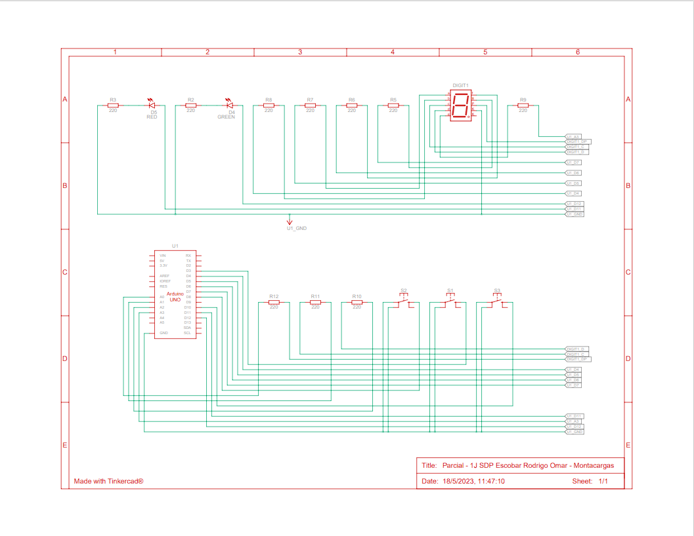

# Primer parcial de SPD

<!-- UL-->
## Alumno:
---
* Rodrigo Omar Escobar

## Proyecto Montacargas de 3 pisos
---


## Descripcion
---
Proyecto de montacargas de 3 pisos, con 3 botones, uno para subir de piso, uno para bajar y otro para denerlo, se puede pararlo cuando el usuario lo desee, su funcion es que no permite subir y/o bajar de piso, ya sea en movimiento o en estado de reposo, contiene 2 led indicadores, uno verde que enciende cuando el montacargas esta en marcha y otro led rojo que indica cuando esta detenido
## Funciones principales
---
Funciones para subir de piso, para bajar y otro para detenerlo, estas funciones usan un contador para subir y bajar de piso, donde le dan la indicacion a un switch para mostrar por el display de 7 segmentos el numero de piso que debe mostrar.
<!-- Bloque de codigos -->
```c++
void subir_piso()//funcion para subir de piso
{
  nro_piso++;//sube un piso
  encender_led(LED_MARCHA, HIGH, LED_PARADA, LOW);//enciende led marcha y apaga el de parada
  for (int tiempo_actual = 0; tiempo_actual < 3000; tiempo_actual += 10)//recorre por 3000ms
  {
    if (digitalRead(PULSADOR_PARADA) == 0)// boton de para durante la marcha
    {
      delay(100);
      detener_montacargas();//funcion para dentener la marcha que esta en proceso 
    }
    Serial.println("SUBIENDO");//dentro del for
  }//fuera del for
  encender_led(LED_PARADA, HIGH, LED_MARCHA, LOW);//completa el piso y enciede el led que esta en parada
}
  
void bajar_piso()//funcion para bajar de piso
{
  nro_piso--; //le resta 1 al contador de piso
  encender_led(LED_MARCHA, HIGH, LED_PARADA, LOW);//enciende led marcha y apaga el de parada
  for (int tiempo_actual = 0; tiempo_actual < 3000; tiempo_actual += 10)
  {
    if (digitalRead(PULSADOR_PARADA) == 0)//recorre por 3000ms
    {
      delay(100);
      detener_montacargas();
    }
    Serial.println("BAJANDO");
  }//fuera del for
  encender_led(LED_PARADA, HIGH, LED_MARCHA, LOW);//enciende el led de parada al completar la marcha
}

void detener_montacargas()//funcion para dentener el montacargas
{
  do{
    delay(150);
    Serial.println("PARADA");
    encender_led(LED_PARADA, HIGH, LED_MARCHA, LOW);
  }while(digitalRead(PULSADOR_PARADA) == 1);//sale del do while al precionar el boton de parada
}
```
Funcion del display donde es comandado a traves del swtich como se explico antes.

```c++
void mostrar_numero_por_display ()// funcion que muestra el nro de piso por el display
{  
  digitalWrite (A, LOW);
  digitalWrite (B, LOW);
  digitalWrite (C, LOW);
  digitalWrite (D, LOW);
  digitalWrite (E, LOW);
  digitalWrite (F, LOW);
  digitalWrite (G, LOW);
  
  switch (nro_piso)
    {
      case 0:
      	digitalWrite (A, HIGH);
        digitalWrite (B, HIGH);
        digitalWrite (C, HIGH);
        digitalWrite (D, HIGH);
        digitalWrite (E, HIGH);
        digitalWrite (F, HIGH);
        break;
      case 1:
        digitalWrite (B, HIGH);
        digitalWrite (C, HIGH);
        break;
      case 2:
        digitalWrite (A, HIGH);
        digitalWrite (B, HIGH);
        digitalWrite (D, HIGH);
        digitalWrite (E, HIGH);
        digitalWrite (G, HIGH);
        break;
      case 3:
        digitalWrite (A, HIGH);
        digitalWrite (B, HIGH);
        digitalWrite (C, HIGH);
        digitalWrite (D, HIGH);
        digitalWrite (G, HIGH);
        break;
    }
}

```
## Link del proyecto
---
* [Proyecto](https://www.tinkercad.com/things/bNp2QRHDYhh?sharecode=J8ogw9SX7kTXkO-vtW1mXZV4U9Q0fco6h8rYiuCzcc0)
## Link del video funcionando
* [Video](https://youtu.be/UXNEi_hCEUc)
