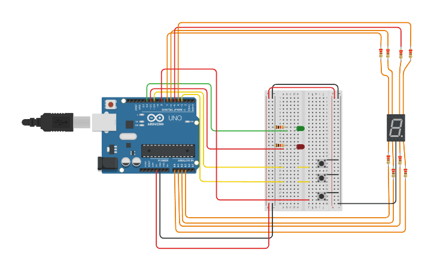

# Primer parcial de SPD

<!-- UL-->
## Alumno:
---
* Rodrigo Omar Escobar

## Proyecto Montacargas de 3 pisos
---

## Descripcion
---
Montacargas hecho en arduino bla bla bla
## Funcion principal
---
<!-- Bloque de codigos -->
```c++
codigo
```
## Link del proyecto
---
* [Proyecto](https://www.tinkercad.com/things/bNp2QRHDYhh?sharecode=J8ogw9SX7kTXkO-vtW1mXZV4U9Q0fco6h8rYiuCzcc0)
## Link del video funcionando
* [Video](link)


